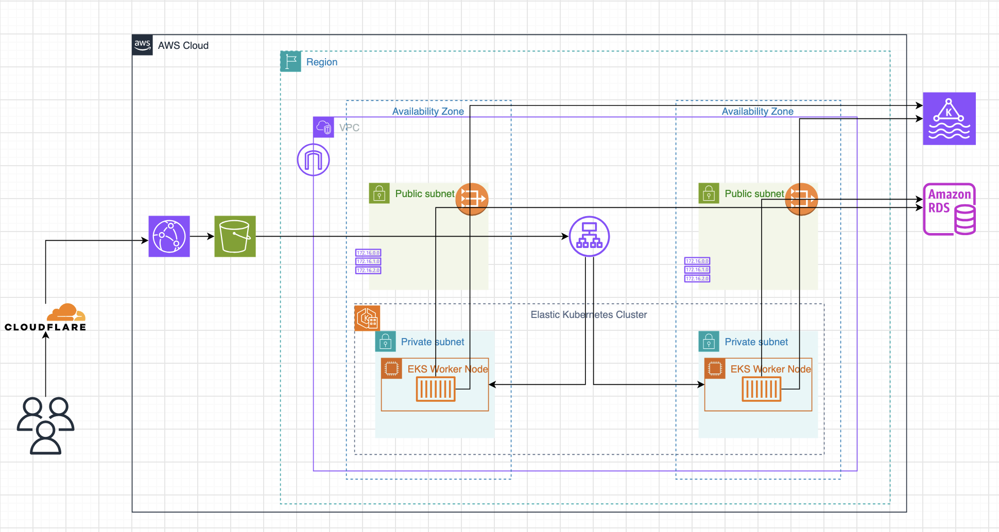

# PulseDesk

PulseDesk is a help-desk application for creating, assigning, and managing support tickets. It includes a React frontend, a Spring Boot API, MySQL persistence, and a Kafka-based ticket assignment service.



## Project structure

| Directory                      | Purpose                                                         |
| ------------------------------ | --------------------------------------------------------------- |
| `pulse-ui`                     | React, TypeScript, Vite, Redux Toolkit, and RTK Query frontend  |
| `pulsedesk`                    | Main Spring Boot REST API and MySQL persistence layer           |
| `pulsedesk-assignment-service` | Kafka consumer that automatically assigns newly created tickets |
| `Pulse-Project-Documents`      | API specifications and architecture documentation               |

## Prerequisites

- Java 17 or newer
- Node.js and npm
- MySQL 8
- Kafka when automatic ticket assignment is required

## Database setup

`pulsedesk-dbschema.sql` is the canonical, final database schema for PulseDesk. It includes the notification table and all required keys, constraints, and indexes.

To create a new development database from the final schema, run:

```bash
mysql -u <user> -p < pulsedesk-dbschema.sql
```

The backend does not currently run database migrations automatically.

## Backend configuration

The main API reads its runtime configuration from environment variables, with local defaults defined in `pulsedesk/src/main/resources/application.properties`.

```bash
export PULSEDESK_SERVER_PORT=80
export PULSEDESK_DB_URL='jdbc:mysql://localhost:3306/pulsedesk'
export PULSEDESK_DB_USERNAME='<user>'
export PULSEDESK_DB_PASSWORD='<password>'
export PULSEDESK_KAFKA_BOOTSTRAP_SERVERS='localhost:9092,localhost:9094'
```

Start the API:

```bash
cd pulsedesk
./mvnw spring-boot:run
```

## Assignment service

The assignment service consumes newly created ticket events and calls the main API to assign an active agent.

```bash
export PULSEDESK_BASE_URL='http://localhost:80'
export PULSEDESK_KAFKA_BOOTSTRAP_SERVERS='localhost:9092,localhost:9094'

cd pulsedesk-assignment-service
./mvnw spring-boot:run
```

## Frontend

Frontend configuration is stored in `pulse-ui/.env`:

```dotenv
VITE_APP_PORT=3000
VITE_API_BASE_URL=http://localhost:80
```

`VITE_APP_PORT` controls the Vite development-server port. `VITE_API_BASE_URL` controls the Spring Boot API URL used by RTK Query. Copy `pulse-ui/.env.example` when creating configuration for another environment.

Vite mode files provide environment-specific API URLs:

| Vite mode   | File               | API URL                            |
| ----------- | ------------------ | ---------------------------------- |
| Local       | `.env`             | `http://localhost:80`              |
| Development | `.env.development` | `https://api-dev.pulsedeskapp.com` |
| UAT         | `.env.uat`         | `https://api-uat.pulsedeskapp.com` |
| Production  | `.env.production`  | `https://api.pulsedeskapp.com`     |

```bash
cd pulse-ui
npm ci
npm run dev:local   # Local API
npm run dev         # Development API
npm run dev:uat     # UAT API
npm run dev:prod    # Production API
```

Environment-specific production bundles can be created with `npm run build:dev`, `npm run build:uat`, or `npm run build:prod`. Jenkins maps its `dev`, `uat`, and `prod` deployment parameters to the matching Vite mode automatically.

Use the URL printed by Vite to open the application.

## Comment notifications

Comment notifications work in both directions:

- A requester/employee comment notifies the ticket's currently assigned agent.
- An agent or administrator comment notifies the ticket requester.
- The comment author is never notified about their own comment.
- An employee comment on an unassigned ticket does not create a notification.

The notification bell appears in the top-right application header. It checks for new notifications every 15 seconds and also refreshes when the browser regains focus or reconnects. Selecting a notification opens and highlights the relevant comment. Viewing the ticket marks that ticket's comment notifications as read.

Notification endpoints are scoped to the authenticated user:

| Method  | Endpoint                                | Purpose                                         |
| ------- | --------------------------------------- | ----------------------------------------------- |
| `GET`   | `/notifications`                        | List notifications                              |
| `GET`   | `/notifications/unread-count`           | Get the unread badge count                      |
| `PATCH` | `/notifications/{notificationId}/read`  | Mark one notification as read                   |
| `PATCH` | `/notifications/ticket/{ticketId}/read` | Mark comment notifications for a ticket as read |
| `PATCH` | `/notifications/read-all`               | Mark every notification as read                 |

## Verification

Run backend checks:

```bash
cd pulsedesk
./mvnw test
```

The Spring integration tests require a reachable and initialized MySQL database.

Run frontend checks:

```bash
cd pulse-ui
npm run lint
npm run build
```

## Postman

Import both files into Postman:

- `postman/PulseDesk.postman_collection.json`
- `postman/PulseDesk-Local.postman_environment.json`

Select the **PulseDesk Local** environment, update `baseUrl`, `loginEmail`, and `loginPassword` if necessary, then run **Auth → Login**. The login test script automatically saves the access token, refresh token, and current user ID. Protected requests inherit `Authorization: Bearer {{accessToken}}` from the collection.

## Additional documentation

- `Pulse-Project-Documents/API_SPEC.md`
- `Pulse-Project-Documents/BACKEND_PLAN.md`
- `Pulse-Project-Documents/SPEC.md`
