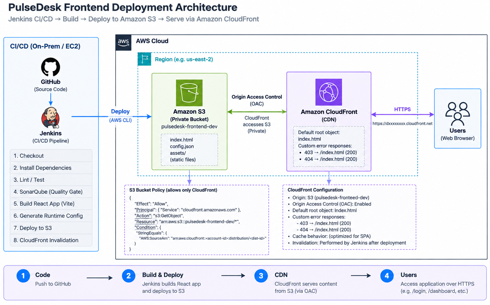
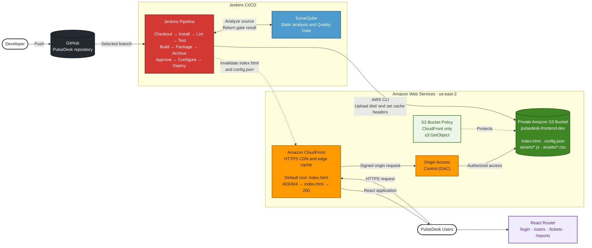

# PulseDesk Frontend Jenkins CI/CD Pipeline

## Overview

The PulseDesk frontend pipeline automates the complete delivery process for the React/Vite application. It retrieves the source code, validates code quality, builds and packages the application, and deploys the generated static files to a private Amazon S3 bucket. Amazon CloudFront securely retrieves the files from S3 and serves the application to users.

The development environment uses the following AWS infrastructure:

- An S3 bucket named `pulsedesk-frontend-dev` stores the built React/Vite application.
- An Amazon CloudFront distribution uses the S3 bucket as its origin.
- Origin Access Control (OAC) keeps the bucket private while allowing CloudFront to retrieve its objects.
- The S3 bucket policy allows only the configured CloudFront distribution to perform `s3:GetObject`.
- The CloudFront default root object is `index.html`.
- CloudFront custom error responses convert `403` and `404` responses to `/index.html` with HTTP status `200`, allowing React Router routes to work when opened directly or refreshed.
- Jenkins invalidates important CloudFront paths after deployment so updated frontend files are served without waiting for cached content to expire.

> **Environment status:** The Jenkins pipeline contains configuration for `dev`, `uat`, and `prod`. The development CloudFront distribution is configured. The UAT and production distribution IDs in the `Jenkinsfile` must be replaced after those distributions are created.

## Pipeline Parameters

The Jenkins job accepts the following inputs:

| Parameter         | Values                           | Purpose                                                                               |
| ----------------- | -------------------------------- | ------------------------------------------------------------------------------------- |
| `BRANCH`          | Git branches; defaults to `main` | Selects the source branch to check out.                                               |
| `ENVIRONMENT`     | `dev`, `uat`, `prod`             | Selects the build mode and target AWS environment.                                    |
| `ACTION`          | `BUILD_ONLY`, `BUILD_AND_DEPLOY` | Determines whether the pipeline stops after creating the artifact or also deploys it. |
| `RELEASE_VERSION` | Optional version such as `1.0.5` | Sets the artifact version. The Jenkins build number is used when this value is empty. |

The pipeline enforces these branch rules:

- Production deployments are allowed only from `main`.
- UAT deployments must use a `release/*` branch.

## Pipeline Flow

```text
GitHub
   |
   v
Validate Parameters
   |
   v
Checkout
   |
   v
Install Dependencies
   |
   v
Lint
   |
   v
Test
   |
   v
Code Quality - SonarQube
   |
   v
Quality Gate
   |
   v
Build React App
   |
   v
Prepare Artifact
   |
   v
Archive Artifact
   |
   v
Prepare Environment Config
   |
   v
Production Approval (PROD only)
   |
   v
Generate Runtime Config
   |
   v
Deploy to S3
   |
   v
Set Cache Headers
   |
   v
CloudFront Invalidation
   |
   v
Deployment Summary
   |
   v
Post Actions
```

When `ACTION` is `BUILD_ONLY`, Jenkins completes the CI stages through `Archive Artifact` and skips all deployment stages.

## Pipeline Stages

|   # | Stage                      | Purpose                                               | What happens                                                                                                                                                           |
| --: | -------------------------- | ----------------------------------------------------- | ---------------------------------------------------------------------------------------------------------------------------------------------------------------------- |
|   1 | Validate Parameters        | Validates Jenkins build inputs                        | Checks the Git branch, target environment, and deployment action before continuing. Production is restricted to `main`, while UAT requires a `release/*` branch.       |
|   2 | Checkout                   | Gets application source code                          | Checks out the requested branch from the PulseDesk GitHub repository into the Jenkins workspace.                                                                       |
|   3 | Install Dependencies       | Installs Node packages                                | Runs `npm ci`, installing the exact dependency versions recorded in `package-lock.json`.                                                                               |
|   4 | Lint                       | Checks source-code quality                            | Runs ESLint against the React/TypeScript project to catch coding errors and style or quality problems.                                                                 |
|   5 | Test                       | Executes automated tests                              | Runs frontend tests when a test script is configured. The current project has no test script, so Jenkins reports this and skips test execution.                        |
|   6 | Code Quality - SonarQube   | Performs static code analysis                         | Sends the `src` directory to SonarQube for analysis of bugs, vulnerabilities, code smells, duplication, and maintainability issues.                                    |
|   7 | Quality Gate               | Prevents poor-quality code from progressing           | Waits up to 10 minutes for SonarQube processing and checks the Quality Gate. The pipeline stops when the gate does not pass.                                           |
|   8 | Build React App            | Creates deployable frontend files                     | Maps the selected environment to its Vite mode and runs the TypeScript/Vite build. Vite places optimized HTML, CSS, JavaScript, and other static resources in `dist/`. |
|   9 | Prepare Artifact           | Packages the application                              | Compresses `dist/` into a versioned `.tar.gz` artifact, such as `pulsedesk-ui-3.tar.gz`.                                                                               |
|  10 | Archive Artifact           | Preserves the build output                            | Archives the generated artifact in Jenkins and records its fingerprint so the exact output can be retained and traced.                                                 |
|  11 | Prepare Environment Config | Selects deployment configuration                      | For `BUILD_AND_DEPLOY`, selects the environment-specific S3 bucket, API URL, AWS Region, and CloudFront distribution.                                                  |
|  12 | Production Approval        | Protects production deployments                       | For production deployments, pauses and requires manual approval. This stage is skipped for development and UAT.                                                        |
|  13 | Generate Runtime Config    | Generates environment-specific frontend configuration | Creates `dist/config.json` containing the selected backend API URL.                                                                                                    |
|  14 | Deploy to S3               | Publishes the React application                       | Runs `aws s3 sync dist/ s3://... --delete` to upload the new files and remove obsolete files from the target bucket.                                                   |
|  15 | Set Cache Headers          | Controls browser and CDN caching                      | Re-uploads `index.html` and `config.json` with `no-cache,no-store,must-revalidate` so clients do not retain outdated application entry points or configuration.        |
|  16 | CloudFront Invalidation    | Refreshes CDN content                                 | Invalidates `/index.html` and `/config.json`, causing CloudFront to retrieve their latest versions from S3.                                                            |
|  17 | Deployment Summary         | Reports deployment information                        | Displays the deployed version, branch, environment, S3 bucket, and CloudFront distribution ID.                                                                         |
|  18 | Declarative: Post Actions  | Handles final pipeline status                         | Runs after pipeline execution and reports whether the PulseDesk frontend pipeline succeeded or failed.                                                                 |

## CI and CD Responsibilities

The pipeline contains both Continuous Integration (CI) and Continuous Delivery/Deployment (CD).

```text
Continuous Integration (CI)
------------------------------------------
Validate Parameters
        |
        v
Checkout
        |
        v
Install Dependencies
        |
        v
Lint
        |
        v
Test
        |
        v
SonarQube
        |
        v
Quality Gate
        |
        v
Build React App
        |
        v
Prepare Artifact
        |
        v
Archive Artifact

Continuous Delivery/Deployment (CD)
------------------------------------------
Prepare Environment Config
        |
        v
Production Approval
        |
        v
Generate Runtime Config
        |
        v
Deploy to S3
        |
        v
Set Cache Headers
        |
        v
CloudFront Invalidation
        |
        v
Deployment Summary
```

CI produces a tested, quality-validated, deployable application artifact. CD takes the application and its environment configuration and deploys them to the selected AWS environment.

## AWS Infrastructure Setup

The frontend hosting infrastructure must exist before Jenkins can deploy the application.

### 1. Private S3 Bucket

The development environment uses:

```text
pulsedesk-frontend-dev
```

The bucket stores the generated Vite application:

```text
pulsedesk-frontend-dev/
|-- index.html
|-- config.json
|-- favicon.svg
|-- icons.svg
`-- assets/
    |-- *.js
    `-- *.css
```

The bucket remains private with S3 Block Public Access enabled. Users do not access its objects directly.

### 2. CloudFront Distribution

The CloudFront distribution uses the regional S3 endpoint as its origin:

```text
pulsedesk-frontend-dev.s3.us-east-2.amazonaws.com
```

CloudFront is the public entry point for the PulseDesk frontend:

```text
Browser --> CloudFront --> Private S3 bucket
```

### 3. Origin Access Control (OAC)

CloudFront Origin Access Control authorizes requests from the distribution to the private S3 bucket:

```text
Internet
   |
   v
CloudFront
   |
   | Authorized through OAC
   v
Private S3 bucket
```

The S3 bucket policy grants the specific CloudFront distribution permission to perform:

```text
s3:GetObject
```

The resulting access model is:

```text
Direct public S3 access: denied
CloudFront-to-S3 access: allowed
```

## CloudFront SPA Configuration

PulseDesk is a React Single Page Application (SPA), so CloudFront must support client-side routing.

### Default Root Object

Configure the distribution with:

```text
Default root object = index.html
```

When a user visits the CloudFront domain root, CloudFront requests `/index.html`, and the React application loads.

### Custom Error Responses

Configure both CloudFront error responses as follows:

| Origin response | Response page path | HTTP response code |
| --------------- | ------------------ | ------------------ |
| `403`           | `/index.html`      | `200`              |
| `404`           | `/index.html`      | `200`              |

This configuration solves the React Router refresh problem. In normal in-browser navigation, React Router handles routes such as `/login`. When a user directly opens or refreshes `/login`, however, the browser sends that path to CloudFront. S3 has no object named `login`, so it returns `403` or `404`.

With the custom error responses configured, the request is handled as follows:

```text
Browser
   |
   | GET /login
   v
CloudFront
   |
   v
S3
   |
   | 403 or 404
   v
CloudFront serves /index.html with HTTP 200
   |
   v
React application loads
   |
   v
React Router reads /login
   |
   v
Login page
```

The same mechanism supports direct access and refreshes for application routes including:

- `/login`
- `/dashboard`
- `/tickets`
- `/assets`
- `/users`
- `/reports`

## CloudFront Cache Invalidation

CloudFront caches content at edge locations. After Jenkins uploads a new frontend version to S3, users could otherwise receive an older cached entry point or runtime configuration until the cached objects expire.

The pipeline therefore runs `aws cloudfront create-invalidation` for:

```text
/index.html
/config.json
```

The deployment flow is:

```text
Jenkins
   |
   | Build React application
   v
dist/
   |
   | Upload
   v
Private S3 bucket
   |
   | Origin
   v
CloudFront
   |
   | Invalidate old index and config objects
   v
Users receive the latest application
```

## Complete Frontend Architecture





In this architecture:

- Jenkins builds, validates, packages, and deploys PulseDesk.
- SonarQube performs static code-quality analysis and enforces the Quality Gate.
- S3 privately stores the built React/Vite static files.
- CloudFront acts as the public CDN and securely accesses S3 through OAC.
- CloudFront uses `index.html` as the default root object.
- Custom `403` and `404` responses serve `/index.html` with HTTP `200`, enabling SPA routes.
- Cache invalidation ensures users receive the current application entry point and configuration after deployment.

## Jenkins and AWS Prerequisites

The Jenkins agent and controller configuration must provide:

- Node.js and npm.
- The AWS CLI with permission to synchronize objects to the target S3 bucket and create invalidations for the target CloudFront distribution.
- The Jenkins Git Parameter plugin for the `BRANCH` parameter.
- A SonarScanner installation named `eventcart-sonar-scanner`.
- A SonarQube server configuration named `sonarqube-server-local`.
- SonarQube credentials stored in Jenkins with the ID `sonarqubeLocalhost`.
- A SonarQube webhook configured for Jenkins so `waitForQualityGate()` can receive the analysis result.

Before enabling UAT or production deployments, create their S3 buckets and CloudFront distributions, apply the same OAC and SPA-routing configuration, and replace the placeholder CloudFront distribution IDs in the `Jenkinsfile`.
